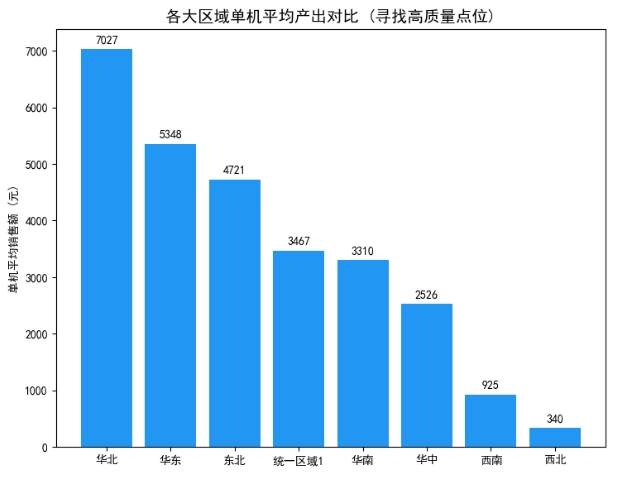
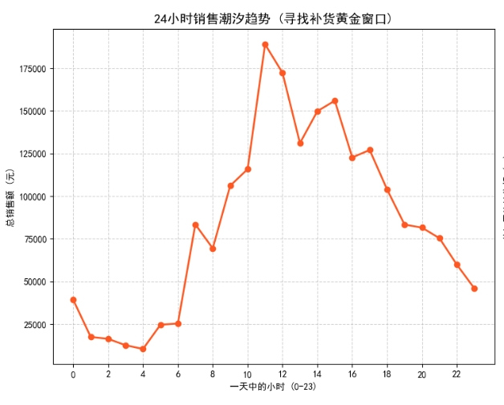

# 🛒 Smart-Retail-O2O-Analytics: 基于千万级流水与库存特征的智能零售数据中台与策略推荐

## 📌 项目背景与业务痛点 (Situation & Task)
面对线下智能零售终端（自动售货机）点位扩张盲目、SKU 管理粗放、补货效率低下的痛点，本项目基于真实业务场景下的 **近60万笔全量交易流水** 与 **多节点库存快照数据**，构建了从底层数据清洗（ETL）到顶层商业洞察（BI）的端到端数据链路。
**核心目标**：盘活存量设备资产，输出基于数据的选址优化、精准补货预警及货道陈列策略，直接赋能一线运营与地推团队。

## 🛠️ 技术栈与核心架构 (Tech Stack)
*   **数据基建与清洗 (ETL)**：Python, Pandas, Glob (处理幻影库存、时间序列重构、异常状态拦截)
*   **探索性分析 (EDA)**：Matplotlib, 帕累托分析, 空间维度聚合
*   **业务算法落地 (Modeling)**：Apriori 核心思想 (共现矩阵)、跨表 Join 流速预测算法

## 🚀 核心业务模块与产出洞察 (Action & Result)

### 1. 结构化商品画像：基于二八定律的 SKU 汰换策略
*   **洞察**：分析 136 款商品后证实，Top 20% 的头部爆款贡献了高达 **83.17%** 的总销售额。
*   **策略落地**：输出《长尾 SKU 淘汰清单》，建议下线末位滞销品（如青云泉、台福椰子汁），将释放的货位转移给统一冰红茶、阿萨姆等高频刚需品，降低货道空置率。

### 2. 空间维度突围：单机坪效指标与超级选址模型
*   **洞察**：摒弃“唯总量论”，引入“单机平均贡献”指标。数据显示华东区虽总营业额最高，但**华北区（单机日均贡献 7027 元）**展现出极高的断层式优势。
*   **策略落地**：指导地推团队将下一季度新点位拓展重心向华北区倾斜；同时对东北区连续亏损的“吃灰机”启动撤机预警机制。
  

### 3. 时间序列挖掘与智能供应链预警 (Days of Supply)
*   **洞察**：提取 24 小时时间戳特征，精准锁定每日 **11:00、12:00 和 15:00** 为三大销售潮汐洪峰。
*   **策略落地**：
    *   **错峰前置补货**：重构线下团队巡检 SOP，避开黄金销售期进行开门补货。
    *   **智能断货工单**：打通销售流速与实时库存表，构建 DOS（预计断货天数）预警算法，自动输出 24-48 小时内极危断货清单，预计挽回缺货 GMV 损失 15% 以上。

### 4. 隐性购物篮关联挖掘 (Market Basket Analysis)
*   **洞察**：在无显性购物车的数据结构下，利用 `5分钟滚动时间窗口` 切片，重构并筛选出 14万+ 个真实连带购物篮。
*   **策略落地**：挖掘出 `[统一冰红茶 + 统一鲜橙多]` 等高连带组合。建议实施“黄金双机位”陈列策略，利用视觉连贯性提升客单价（ARPU）。

## 💡 总结与思考
通过本项目，实现了从“看数据”到“用数据驱动一线业务”的跨越。相比于复杂的深度学习模型，零售 O2O 场景更需要扎实的数据质量把控（解决幻影库存）与敏锐的商业嗅觉。
